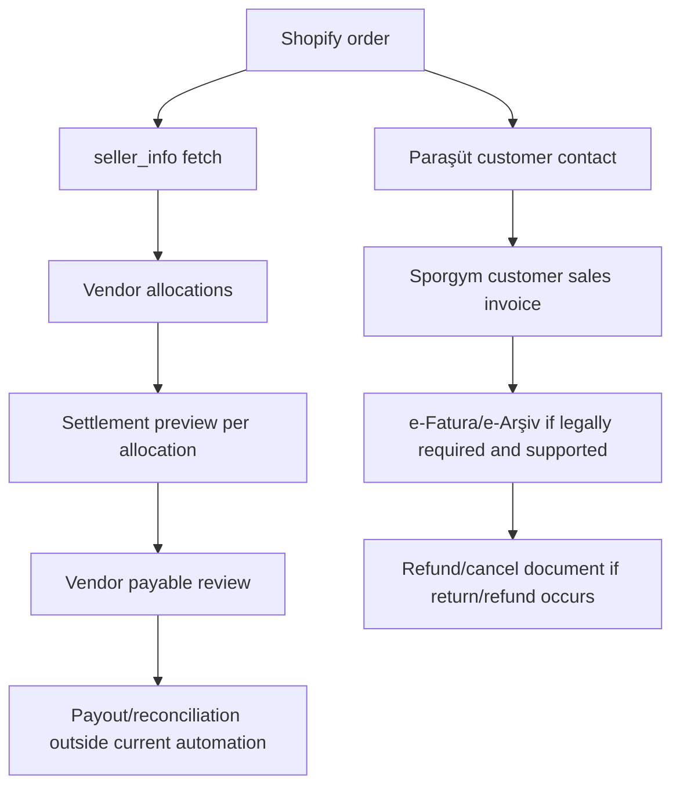
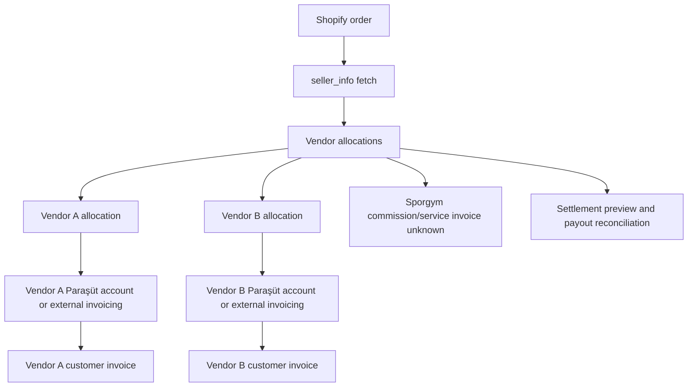
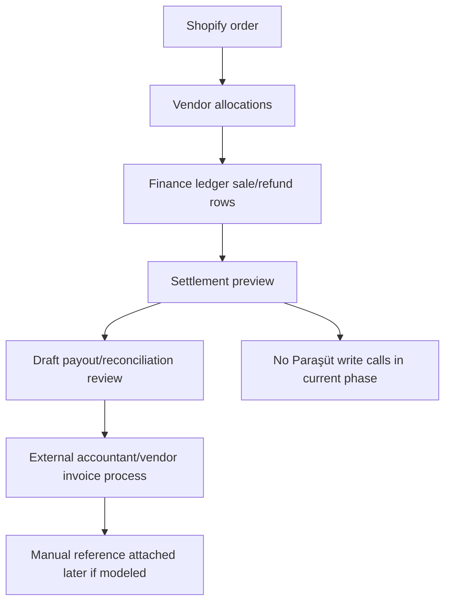

# Paraşüt Marketplace Discovery

## Purpose And Scope

This document captures discovery for possible Paraşüt accounting architecture in the current Shopify multi-vendor operational platform.

Scope:

- Discovery only.
- Paraşüt API capability mapping from available documentation.
- Accounting architecture options for marketplace operations.
- Operational lifecycle mapping against existing Shopify order, vendor allocation, settlement preview, return/refund, and payout/reconciliation concepts.
- Unknowns and required external inputs before implementation.

Non-scope:

- No accounting logic implementation.
- No invoice API calls.
- No Paraşüt credential handling changes.
- No finance calculation changes.
- No database schema changes.
- No production invoice automation recommendation.
- No legal, tax, or accounting conclusion is treated as approved.

Important context:

- iyzico marketplace implementation is paused.
- Shopify hosted checkout plus native iyzico marketplace split is not supported.
- PayTR marketplace research is pending approval/docs access.
- Current focus is Paraşüt API discovery and accounting architecture.

## Sources Reviewed

- Local Shopify source-of-truth document: `docs/SHOPIFY_DISCOVERIES.md`
- Local finance architecture documents:
  - `docs/FINANCE_LEDGER_MODEL.md`
  - `docs/FINANCE_SETTLEMENT_MODEL.md`
  - `docs/MARKETPLACE_FINANCE_WORKFLOW.md`
- Current backend schema and services:
  - `backend/prisma/schema.prisma`
  - `backend/src/modules/shopify/order-ingestion.service.ts`
  - `backend/src/modules/finance/sale-ledger.service.ts`
- Paraşüt public e-document pages:
  - https://www.parasut.com/e-belge
  - https://www.parasut.com/kullanim-kilavuzu/elektronik-fatura-nasil-gonderilir
- Paraşüt API docs:
  - Primary URL: https://apidocs.parasut.com
  - Local direct `curl` access was blocked by Cloudflare during this pass.
  - Available indexed/cached API snippets from the same official docs were reviewed through search and Context7 mirror snippets. Anything not clear from those snippets is marked `unknown` or `requires credentials/testing`.

## Current Marketplace Operational Model

### Shopify Order

- Shopify is the canonical commerce/order source.
- This platform starts after Shopify order creation.
- `orders/create` webhook payload is treated as an event envelope, not final truth.
- Order metafield `custom.seller_info` is fetched separately through Shopify Admin API.
- `seller_info` maps SKU to internal vendor slug.
- Missing SKU or missing seller mapping remains unresolved and must not be guessed.

### Vendor Allocation

- `ShopifyOrderLineItem` stores Shopify line item, SKU, variant id when present, quantity, amount, and original vendor id.
- `VendorAllocation` is allocation-scoped and carries `originalVendorId`, `assignedVendorId`, fulfillment/shipping state, and reassignment state.
- `VendorAllocationLineItem` links allocation slices to Shopify line items.
- Multi-vendor orders are represented by multiple allocations, not one blended vendor record.

### Settlement Preview

- Finance values are operational estimates/review artifacts unless explicitly approved and paid by a future workflow.
- `VendorFinancialProfile` stores commission and shipping deduction configuration.
- `FinanceLedgerEntry` stores vendor-scoped sale/refund rows with profile snapshots and settlement state.
- `PayoutBatch` and `PayoutBatchLine` are draft/review artifacts, not payment execution.

### Return/Refund

- Customer return request is not the same event as refund creation.
- `refunds/create` creates vendor-scoped refund records and refund finance rows.
- Return lifecycle records and refund rows must stay allocation-scoped.
- Invoice cancellation/refund-note behavior is not modeled in the platform today.

### Payout/Reconciliation

- The current platform provides payout preparation and reconciliation visibility.
- It does not execute payouts, bank transfers, accounting exports, or tax documents.
- It must preserve auditability, vendor isolation, and allocation-level scoping.

## Invoice Ownership Model Options

### Option 1: Marketplace As Merchant Of Record

| Area | Discovery |
| --- | --- |
| Customer invoice owner | Sporgym/marketplace issues the customer invoice. |
| Vendor invoice owner | Vendors may issue supplier/service invoices to Sporgym for settlement, or vendor payable may be handled through another accountant-approved document flow. Exact requirement is unknown. |
| Commission invoice owner | Marketplace commission may be internal margin rather than a separate commission invoice, or may still require vendor-facing commission documentation. Unknown. |
| Payout handling | Platform settlement preview could become the internal basis for vendor payable review, but payout execution remains outside current scope. |
| Refund/cancel handling | If this model is approved, marketplace would own customer-facing cancellation/refund documents. Vendor-side adjustment/debt documentation is unknown. |
| Risks | Requires clear seller-of-record/legal ownership; may put full customer invoice/tax responsibility on Sporgym; multi-vendor order allocation must not leak into customer invoice incorrectly. |
| Unknowns | Whether Sporgym may legally issue customer invoices for all goods; vendor supplier invoice obligations; commission VAT treatment; refund/cancel document requirements; e-fatura/e-arşiv obligations. |

Fit:

- Operationally simplest for Shopify customer order flow because one customer invoice can represent the Shopify order.
- Potentially complex for vendor settlement and supplier documentation.
- Needs accountant/legal approval before any implementation.

### Option 2: Vendor As Merchant Of Record

| Area | Discovery |
| --- | --- |
| Customer invoice owner | Each vendor issues the customer invoice for its allocation. |
| Vendor invoice owner | Vendor owns the customer sales document; Sporgym may receive or reconcile vendor-issued documents. |
| Commission invoice owner | Sporgym may issue commission/service invoices to vendors, but exact ownership and VAT treatment are unknown. |
| Payout handling | Payout/reconciliation may represent marketplace collections owed to vendors minus commission/service charges. |
| Refund/cancel handling | Vendor may need to issue cancellation/refund documents for its invoice; Sporgym settlement adjusts allocation rows. |
| Risks | Multi-vendor Shopify order could require multiple customer invoices; customer identity and invoice delivery ownership become complex; each vendor may need a Paraşüt account or external accounting flow. |
| Unknowns | Whether vendors are legally seller of record; whether vendors must each use Paraşüt; whether Sporgym can issue or send invoices on vendor behalf; how customer consent/data sharing works. |

Fit:

- Matches allocation ownership more directly.
- Adds high operational burden for vendor credential/account management and invoice lifecycle orchestration.
- Likely harder for a single Shopify checkout/order confirmation experience.

### Option 3: Hybrid / Settlement-Only Model

| Area | Discovery |
| --- | --- |
| Customer invoice owner | External to this platform or handled manually in Paraşüt/admin process until legal model is decided. |
| Vendor invoice owner | Vendors invoice externally or through their own accounting process. |
| Commission invoice owner | Sporgym commission invoicing remains manual or future Paraşüt process after ownership confirmation. |
| Payout handling | Platform keeps settlement previews, payout draft/review artifacts, and reconciliation evidence only. |
| Refund/cancel handling | Platform records operational settlement adjustments; accounting documents are handled outside automation. |
| Risks | Lower automation but avoids premature accounting mistakes; manual reconciliation burden remains. |
| Unknowns | Which documents must still be generated; whether Paraşüt should be integrated at all; how external invoice references are attached back to allocations. |

Fit:

- Best current fit with existing platform boundaries.
- Preserves settlement preview language and avoids production invoice automation.
- Supports a read-only mapping/prototype phase before irreversible accounting behavior.

## Paraşüt API Capability Checklist

Status meanings:

- `supported`: Visible in available Paraşüt docs/snippets.
- `unsupported`: Available docs clearly indicate the capability is not provided.
- `unknown`: Not proven from available official docs.
- `requires credentials/testing`: Endpoint or concept appears present, but behavior, permissions, activation, or lifecycle must be verified with a real/test company.

| Capability | Status | Evidence / Notes |
| --- | --- | --- |
| Customer/contact creation | supported | API docs describe contact/customer creation and `contacts` as the required customer/supplier resource before invoice creation. |
| Sales invoice creation | supported | API docs show `POST /sales_invoices` / sales invoice creation requiring contact and product/line item relationships. |
| e-invoice support | requires credentials/testing | Public Paraşüt docs confirm e-Fatura product support. API snippets show `POST /v4/e_invoices`, `GET /v4/e_invoices/{id}`, PDF retrieval, and e-invoice inbox lookup. Activation, permissions, and production constraints require testing. |
| e-archive support | requires credentials/testing | Public Paraşüt docs confirm e-Arşiv product support. API snippets show `POST /v4/e_archives`, `GET /v4/e_archives/{id}`, PDF retrieval, and e-archive status fields. Activation and behavior require testing. |
| Draft invoice support | unknown | Paraşüt UI flow creates a sales invoice before electronic formalization, but available API snippets do not prove a stable draft-only API lifecycle suitable for automation. |
| Invoice status retrieval | supported | Sales invoice list/show includes invoice/payment fields; e-document show/PDF endpoints expose status-related data. |
| Webhook support | supported | API docs snippets include webhook request shape, resource/action/event date, and SHA256 signature header. Registration/configuration details require credentials/testing. |
| Payment status/payment recording | requires credentials/testing | Sales invoice fields include `payment_status`, relationships include `payments`/`payments.transaction`, and snippets show pay-sales-invoice request body. Exact payment recording flow needs testing. |
| Expense/payout recording | requires credentials/testing | Purchase bills and payments exist in API snippets; vendor payout as marketplace settlement is not directly proven. Treat payout recording as unknown until accountant-approved mapping is tested. |
| Tags/custom fields | tags supported; custom fields unknown | Tags API supports CRUD. No official custom-field support was proven from available docs. |
| Line item support | supported | Sales invoice creation and response relationships include details/line items/products. |
| Partial refund/cancel support | cancel supported; partial refund unknown | API snippets show sales invoice cancel endpoint and invoice item types including `refund`; partial refund/cancel semantics are not proven. |

Additional API observations:

- Paraşüt API V4 uses OAuth2 access tokens.
- Base API pattern is `https://api.parasut.com/v4/{company_id}`.
- Available docs state a rate limit of 10 requests per 10 seconds.
- E-document/PDF generation can involve asynchronous `trackable_jobs`; snippets show job statuses such as `pending`, `running`, `error`, and `done`.
- Paraşüt public docs state e-Fatura/e-Arşiv sending depends on electronic invoice activation and customer tax-number detection.

## Architecture Options

### One Paraşüt Account For Sporgym Marketplace

Pros:

- One credential set and one company context.
- Better fit if Sporgym is merchant of record.
- Easier to map Shopify order to one customer invoice.
- Lower operational burden than vendor-specific accounts.
- Fits current platform ownership of central operational truth.

Cons:

- Only valid if accountant/legal confirms Sporgym may issue customer invoices.
- Vendor-specific legal invoice obligations may still require separate documents.
- Multi-vendor order invoice line attribution may need internal-only allocation metadata.
- Commission and vendor payout accounting still unresolved.

Operational burden:

- Medium. Centralized credentials and invoice lifecycle, but high accounting correctness burden.

Credential/account ownership:

- Sporgym owns Paraşüt company credentials.
- Backend secret management must be production-grade before any live use.

Tax/legal unknowns:

- Seller-of-record status.
- Whether marketplace gross sales should be booked by Sporgym.
- Vendor supplier invoice/commission VAT requirements.

API complexity:

- Medium. Contact, sales invoice, e-document, payment, and cancellation flows under one company.

Fit with current allocation/settlement preview:

- Good for central order ingestion.
- Needs careful allocation metadata so vendor settlement rows reconcile to invoice lines.

### Vendor-Specific Paraşüt Accounts

Pros:

- Better fit if vendors are merchant of record.
- Vendor invoices can be issued from vendor-owned accounting accounts.
- Vendor legal/tax boundaries may be cleaner if confirmed.

Cons:

- Requires each vendor to have and authorize a Paraşüt account.
- Credential onboarding, rotation, revocation, and support become major features.
- Multi-vendor Shopify orders may require multiple customer invoices.
- Platform may need to coordinate invoice status across many accounts.
- Vendor isolation risk increases if account mapping is wrong.

Operational burden:

- High. Each vendor account becomes an integration tenant.

Credential/account ownership:

- Vendors own credentials/accounts.
- Platform needs an authorization and secret-storage model not currently implemented.

Tax/legal unknowns:

- Whether Sporgym can facilitate invoices on vendor behalf.
- Customer data sharing and invoice delivery responsibility.
- Commission invoice requirement from Sporgym to each vendor.

API complexity:

- High. Same API flows repeated per vendor account/company id, with vendor-specific credentials and failure modes.

Fit with current allocation/settlement preview:

- Strong allocation fit, weak current infrastructure fit.
- Requires new vendor account readiness before automation.

### Hybrid Settlement-Only Model

Pros:

- Preserves current platform role as operational control center.
- Avoids premature legal/accounting automation.
- Lets settlement preview remain estimate/reconciliation evidence.
- Allows read-only Paraşüt mapping/prototypes before create calls.
- Compatible with external vendor invoice processes.

Cons:

- Does not reduce manual accounting work immediately.
- Operators must reconcile external invoice/payment documents manually.
- Requires clear external references if invoices are created outside the platform.

Operational burden:

- Low to medium. Fewer API writes; more manual review.

Credential/account ownership:

- Could start with no production credentials or read-only/test credentials only.
- External accounting users retain document responsibility.

Tax/legal unknowns:

- Still requires merchant-of-record decision before automation.
- External invoice ownership and required references must be defined.

API complexity:

- Low at first. Read-only mapping/prototype can inspect contacts/invoices/status without creating official documents.

Fit with current allocation/settlement preview:

- Best near-term fit.
- Keeps settlement preview separate from accounting authority.

## Operational Lifecycle Mapping

### A. Normal Sale

```text
Shopify order
  -> orders/create webhook envelope
  -> canonical seller_info fetch
  -> vendor allocation
  -> sale finance ledger row
  -> settlement preview
  -> Paraşüt contact/invoice/payment concepts
```

Discovery notes:

- Candidate mapping: Paraşüt contact/customer may map to Shopify customer or another accountant-approved invoice recipient. This is not proven.
- Sales invoice line items could map to Shopify line items or allocation line items depending on merchant-of-record decision.
- Payment status/payment recording could map to Shopify payment evidence only after payment authority is confirmed.
- E-Fatura/e-Arşiv choice appears tied to customer tax-number/e-document status and Paraşüt activation.

Unknown:

- Who issues the customer invoice.
- Whether one Shopify order should become one invoice or allocation-scoped invoices.
- Whether Shopify payment state is sufficient for Paraşüt payment recording.

### B. Multi-Vendor Order

```text
Shopify order
  -> multiple SKU/vendor mappings
  -> multiple VendorAllocation records
  -> invoice ownership uncertainty
  -> vendor-scoped settlement records
```

Discovery notes:

- Current platform correctly scopes operations by allocation.
- Paraşüt invoice ownership does not automatically follow allocation ownership.
- A marketplace merchant-of-record model could keep one customer invoice and internal vendor settlement rows.
- A vendor merchant-of-record model may require one customer invoice per vendor allocation.

Unknown:

- Whether customer should receive one invoice or multiple invoices.
- Whether invoice line metadata can safely preserve vendor allocation references.
- Whether vendors need their own Paraşüt accounts.

### C. Return/Refund

```text
Shopify return/refund
  -> vendor allocation adjustment
  -> refund record / finance ledger row
  -> settlement adjustment
  -> Paraşüt cancellation/refund note unknowns
```

Discovery notes:

- Paraşüt API snippets show invoice cancellation endpoint.
- Purchase/sales item types include `refund` in some list filters.
- Current platform records Shopify refund rows and settlement impact, but does not create accounting documents.

Unknown:

- Whether partial refunds require credit notes, cancellation, return invoices, or another Paraşüt document type.
- Whether cancellation is allowed after e-Fatura/e-Arşiv status changes.
- How return shipping or vendor fault should be documented.

### D. Vendor Payout

```text
settlement preview
  -> payout/reconciliation review
  -> draft payout batch artifact
  -> Paraşüt expense/payment/accounting concept unknowns
```

Discovery notes:

- Paraşüt purchase bills, payments, transactions, and tags appear in available API snippets.
- Current payout batches are not payment execution.

Unknown:

- Whether vendor payout should be recorded as purchase bill, expense, payment, bank transaction, or manual accountant process.
- Whether commission should be netted, invoiced separately, or recorded as marketplace revenue.
- Whether vendor payout records should be created in Sporgym account or vendor accounts.

## Accounting Flow Diagrams

### Marketplace Merchant-Of-Record Flow



### Vendor Merchant-Of-Record Flow



### Hybrid Settlement-Only Flow



## Recommended Direction

Recommended incremental direction:

1. Phase 0: docs/API/credentials discovery
   - Obtain official Paraşüt API docs/access.
   - Confirm API scopes, OAuth app setup, company id model, test company availability, e-document activation requirements, webhook setup, and rate limits.
   - Confirm merchant-of-record model with accountant/legal before any accounting data write.

2. Phase 1: read-only mapping/prototype
   - Prototype mapping from Shopify order/allocation to hypothetical Paraşüt contact/invoice/payment concepts.
   - Use fixtures or read-only API calls only.
   - Produce diagnostics with ids/presence booleans, not raw payloads or secrets.

3. Phase 2: sandbox create draft invoices only, if supported
   - Only if Paraşüt supports a safe draft/non-official invoice state through API.
   - Use sandbox/test company credentials.
   - Do not formalize e-Fatura/e-Arşiv in this phase.

4. Phase 3: controlled e-invoice/e-archive testing
   - Test e-Fatura/e-Arşiv creation only after accountant approval and Paraşüt test-company readiness.
   - Confirm asynchronous job behavior, status polling, PDF retrieval, cancellation rules, and webhook behavior.

5. Phase 4: production rollout behind feature flags
   - Feature flags must default off.
   - Production rollout must start with narrowly scoped vendors/orders.
   - Logs must be redacted.
   - Recovery/replay and idempotency behavior must be explicit before any production write.

Do not recommend production invoice automation yet.

Near-term preference:

- Use the hybrid settlement-only model until seller-of-record, vendor invoicing responsibility, and Paraşüt credential/account ownership are confirmed.

## Explicit Unknowns

- Seller-of-record decision.
- Legal/tax ownership.
- Whether vendors need their own Paraşüt accounts.
- Whether Sporgym may issue customer invoices.
- Commission invoice ownership.
- Refund/cancel document requirements.
- E-Fatura/e-Arşiv implications.
- API credential model.
- Webhook availability and registration details.
- Status lifecycle details.
- Rate limits beyond the documented 10 requests per 10 seconds.
- Sandbox/test environment availability.
- Whether e-document creation is always asynchronous or only some document/PDF workflows are asynchronous.
- Whether draft invoice creation is safe and non-official through API.
- Whether partial refunds can be represented directly or require accountant-guided manual documents.
- How external invoice references should attach to allocation/finance records.

## Required External Inputs Before Implementation

- Paraşüt API docs link/access.
- Paraşüt sandbox or test company credentials.
- Accountant/legal confirmation of merchant-of-record model.
- Required invoice scenarios from accountant.
- Vendor invoicing responsibility decision.
- E-Fatura/e-Arşiv usage requirements.
- Refund/cancellation accounting requirements.
- Paraşüt OAuth/client setup details.
- Paraşüt webhook setup instructions and signing secret/encryption key model.
- Paraşüt e-document activation status for the intended company/account.
- Confirmation of whether test e-Fatura/e-Arşiv documents can be created without legal production effect.

## Implementation Stop Conditions

- Merchant-of-record model is not approved.
- Paraşüt credentials are unavailable or production-only.
- E-Fatura/e-Arşiv activation requirements are unknown.
- Refund/cancel document requirements are unknown.
- Vendor account ownership is unresolved.
- API behavior can only be inferred from unofficial SDKs.
- Any proposed implementation would create official accounting documents before sandbox/test confirmation.
