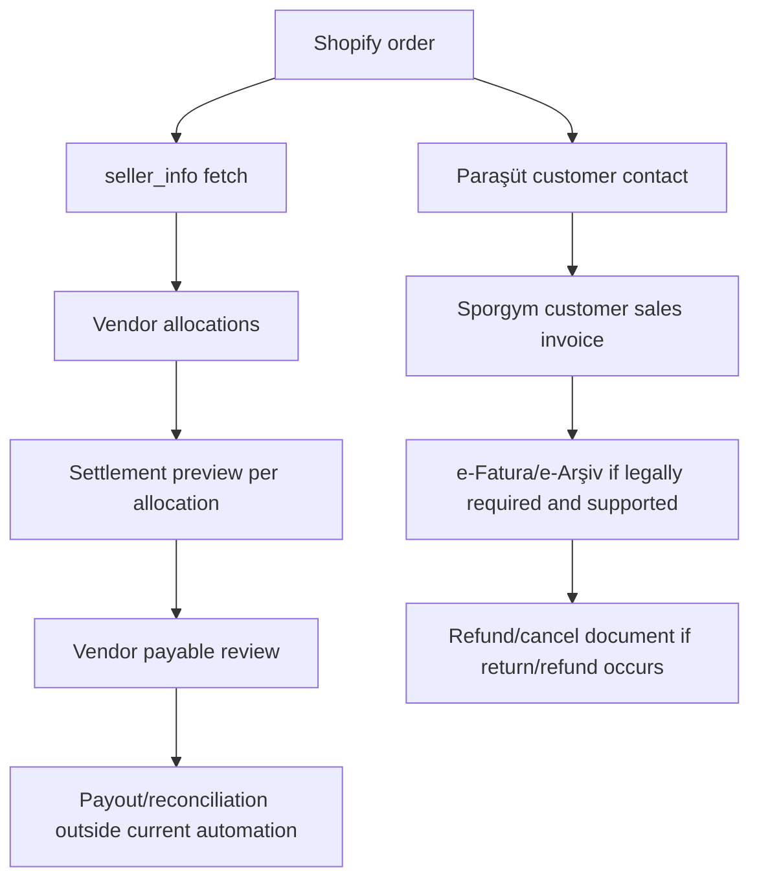
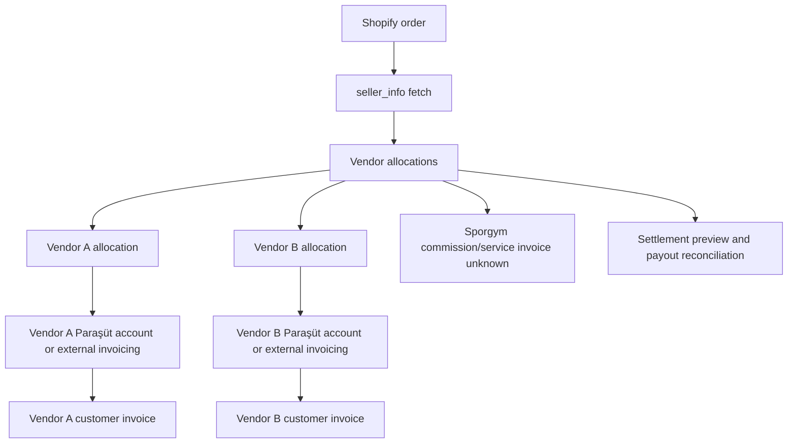
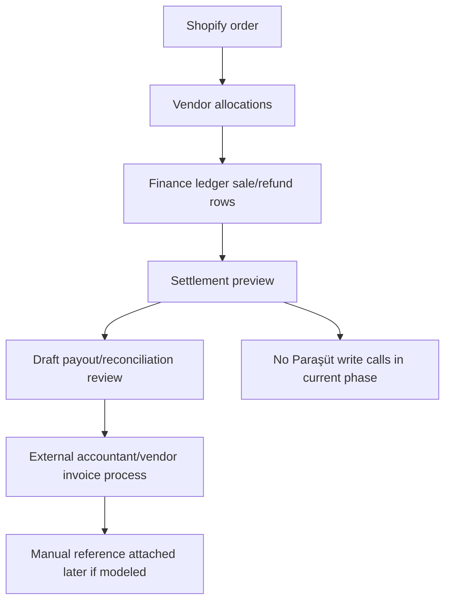

# Paraşüt Marketplace Discovery

## Purpose And Scope

This document captures discovery for possible Paraşüt accounting architecture in the current Shopify multi-vendor operational platform.

Scope:

- Discovery only.
- Paraşüt API capability mapping from available documentation.
- Accounting architecture options for marketplace operations.
- Operational lifecycle mapping against existing Shopify order, vendor allocation, settlement preview, return/refund, and payout/reconciliation concepts.
- Unknowns and required external inputs before implementation.

Non-scope:

- No accounting logic implementation.
- No invoice API calls.
- No Paraşüt credential handling changes.
- No finance calculation changes.
- No database schema changes.
- No production invoice automation recommendation.
- No legal, tax, or accounting conclusion is treated as approved.

Important context:

- iyzico marketplace implementation is paused.
- Shopify hosted checkout plus native iyzico marketplace split is not supported.
- PayTR marketplace research is pending approval/docs access.
- Current focus is Paraşüt API discovery and accounting architecture.

## Sources Reviewed

- Local Shopify source-of-truth document: `docs/SHOPIFY_DISCOVERIES.md`
- Local finance architecture documents:
  - `docs/FINANCE_LEDGER_MODEL.md`
  - `docs/FINANCE_SETTLEMENT_MODEL.md`
  - `docs/MARKETPLACE_FINANCE_WORKFLOW.md`
- Current backend schema and services:
  - `backend/prisma/schema.prisma`
  - `backend/src/modules/shopify/order-ingestion.service.ts`
  - `backend/src/modules/finance/sale-ledger.service.ts`
- Paraşüt API V4 documentation reviewed manually.
- No accounting/legal behavior is inferred from the API surface. If a behavior is not explicitly confirmed by the reviewed API documentation, it is marked `unknown`.

## Most Important Discovery

Paraşüt appears to provide:

- accounting primitives;
- invoice lifecycle;
- payment lifecycle;
- supplier/customer ledger structures.

Paraşüt does not appear to provide, from the reviewed API documentation:

- native marketplace split accounting;
- submerchant settlement logic;
- vendor payout orchestration;
- marketplace commission automation.

Therefore, Sporgym would likely need to implement:

- settlement ledger;
- vendor allocation accounting orchestration;
- reconciliation layer;
- payout tracking layer.

Paraşüt should be treated as accounting infrastructure, not as a native marketplace settlement engine, until contrary official documentation or Paraşüt confirmation proves otherwise.

## Current Marketplace Operational Model

### Shopify Order

- Shopify is the canonical commerce/order source.
- This platform starts after Shopify order creation.
- `orders/create` webhook payload is treated as an event envelope, not final truth.
- Order metafield `custom.seller_info` is fetched separately through Shopify Admin API.
- `seller_info` maps SKU to internal vendor slug.
- Missing SKU or missing seller mapping remains unresolved and must not be guessed.

### Vendor Allocation

- `ShopifyOrderLineItem` stores Shopify line item, SKU, variant id when present, quantity, amount, and original vendor id.
- `VendorAllocation` is allocation-scoped and carries `originalVendorId`, `assignedVendorId`, fulfillment/shipping state, and reassignment state.
- `VendorAllocationLineItem` links allocation slices to Shopify line items.
- Multi-vendor orders are represented by multiple allocations, not one blended vendor record.

### Settlement Preview

- Finance values are operational estimates/review artifacts unless explicitly approved and paid by a future workflow.
- `VendorFinancialProfile` stores commission and shipping deduction configuration.
- `FinanceLedgerEntry` stores vendor-scoped sale/refund rows with profile snapshots and settlement state.
- `PayoutBatch` and `PayoutBatchLine` are draft/review artifacts, not payment execution.

### Return/Refund

- Customer return request is not the same event as refund creation.
- `refunds/create` creates vendor-scoped refund records and refund finance rows.
- Return lifecycle records and refund rows must stay allocation-scoped.
- Invoice cancellation/refund-note behavior is not modeled in the platform today.

### Payout/Reconciliation

- The current platform provides payout preparation and reconciliation visibility.
- It does not execute payouts, bank transfers, accounting exports, or tax documents.
- It must preserve auditability, vendor isolation, and allocation-level scoping.

## Invoice Ownership Model Options

### Option 1: Marketplace As Merchant Of Record

| Area | Discovery |
| --- | --- |
| Customer invoice owner | Sporgym/marketplace issues the customer invoice. |
| Vendor invoice owner | Vendors may issue supplier/service invoices to Sporgym for settlement, or vendor payable may be handled through another accountant-approved document flow. Exact requirement is unknown. |
| Commission invoice owner | Marketplace commission may be internal margin rather than a separate commission invoice, or may still require vendor-facing commission documentation. Unknown. |
| Payout handling | Platform settlement preview could become the internal basis for vendor payable review, but payout execution remains outside current scope. |
| Refund/cancel handling | If this model is approved, marketplace would own customer-facing cancellation/refund documents. Vendor-side adjustment/debt documentation is unknown. |
| Risks | Requires clear seller-of-record/legal ownership; may put full customer invoice/tax responsibility on Sporgym; multi-vendor order allocation must not leak into customer invoice incorrectly. |
| Unknowns | Whether Sporgym may legally issue customer invoices for all goods; vendor supplier invoice obligations; commission VAT treatment; refund/cancel document requirements; e-fatura/e-arşiv obligations. |

Fit:

- Operationally simplest for Shopify customer order flow because one customer invoice can represent the Shopify order.
- Potentially complex for vendor settlement and supplier documentation.
- Needs accountant/legal approval before any implementation.

### Option 2: Vendor As Merchant Of Record

| Area | Discovery |
| --- | --- |
| Customer invoice owner | Each vendor issues the customer invoice for its allocation. |
| Vendor invoice owner | Vendor owns the customer sales document; Sporgym may receive or reconcile vendor-issued documents. |
| Commission invoice owner | Sporgym may issue commission/service invoices to vendors, but exact ownership and VAT treatment are unknown. |
| Payout handling | Payout/reconciliation may represent marketplace collections owed to vendors minus commission/service charges. |
| Refund/cancel handling | Vendor may need to issue cancellation/refund documents for its invoice; Sporgym settlement adjusts allocation rows. |
| Risks | Multi-vendor Shopify order could require multiple customer invoices; customer identity and invoice delivery ownership become complex; each vendor may need a Paraşüt account or external accounting flow. |
| Unknowns | Whether vendors are legally seller of record; whether vendors must each use Paraşüt; whether Sporgym can issue or send invoices on vendor behalf; how customer consent/data sharing works. |

Fit:

- Matches allocation ownership more directly.
- Adds high operational burden for vendor credential/account management and invoice lifecycle orchestration.
- Likely harder for a single Shopify checkout/order confirmation experience.

### Option 3: Hybrid / Settlement-Only Model

| Area | Discovery |
| --- | --- |
| Customer invoice owner | External to this platform or handled manually in Paraşüt/admin process until legal model is decided. |
| Vendor invoice owner | Vendors invoice externally or through their own accounting process. |
| Commission invoice owner | Sporgym commission invoicing remains manual or future Paraşüt process after ownership confirmation. |
| Payout handling | Platform keeps settlement previews, payout draft/review artifacts, and reconciliation evidence only. |
| Refund/cancel handling | Platform records operational settlement adjustments; accounting documents are handled outside automation. |
| Risks | Lower automation but avoids premature accounting mistakes; manual reconciliation burden remains. |
| Unknowns | Which documents must still be generated; whether Paraşüt should be integrated at all; how external invoice references are attached back to allocations. |

Fit:

- Best current fit with existing platform boundaries.
- Preserves settlement preview language and avoids production invoice automation.
- Supports a read-only mapping/prototype phase before irreversible accounting behavior.

## Paraşüt API Capability Checklist

Status meanings:

- `supported`: Present in the provided Paraşüt API V4 facts.
- `supported, async`: Present in the provided facts and explicitly asynchronous.
- `partially supported`: Some required API surface is present in the provided facts, but lifecycle semantics are incomplete.
- `unknown`: Not present in the provided facts.

| Capability | Status | Evidence / Notes |
| --- | --- | --- |
| Customer/contact creation | supported | Customer/supplier is modeled as `contact`; contact creation/listing exists. |
| Sales invoice creation | supported | Sales invoice creation exists and requires a Paraşüt contact id; sales invoice line items require product id. |
| Sales invoice CRUD/lifecycle | supported | Sales invoice CRUD, listing/filtering, show, edit, delete, cancel, recover, archive, unarchive, convert estimate to invoice, PDF generation, payments, payment transaction retrieval, and payment transaction deletion are confirmed. Legal/accounting meaning of cancel, recover, and archive is unknown for marketplace compliance. |
| Purchase bill CRUD/lifecycle | supported | Purchase bill CRUD, detailed/basic purchase bills, payments, and cancel/recover/archive lifecycle are confirmed. Purchase bills may support vendor-to-Sporgym invoicing for settlement/commission workflows, but legal correctness and marketplace accounting validity are unknown. |
| e-invoice support | supported, async | e-Fatura formalization exists; e-document creation is asynchronous. |
| e-archive support | supported, async | e-Arşiv formalization exists; e-document creation is asynchronous. |
| e-SMM support | supported, async | e-SMM formalization exists; marketplace use is unknown. |
| Draft invoice support | unknown | Draft invoice API behavior is not present in the provided facts. |
| Invoice status retrieval | partially supported | Invoice show plus `include=active_e_document` is used after successful e-document creation; exact status lifecycle is unknown. |
| Webhook support | unknown | Webhook support is not present in the provided facts. |
| Payment status/payment recording | supported | Payments, transactions, contact debit transactions, contact credit transactions, invoice payment includes, payment status filtering, invoice payments via `include=payments`, payment transactions via `include=payments.transaction`, and payment transaction deletion are confirmed. |
| Expense/payout recording | unknown | Expense/payout APIs are not present in the provided facts. |
| Tags/custom fields | partially confirmed | Sales invoice include options explicitly contain `tags`. Tag existence is confirmed; tag CRUD behavior and arbitrary metadata capacity are unknown. |
| Line item support | supported | Sales invoice line items require product id; invoice details use product relationships. |
| Partial refund/cancel support | unknown | Partial refund/cancel support is not present in the provided facts. |
| Product creation/listing | supported | Product creation/listing exists. |
| Dispatch note/irsaliye | supported | Dispatch note / irsaliye creation exists and requires contact id and product ids. |

Additional API observations:

- API V4 base is `https://api.parasut.com/v4/{firma_no}`.
- Auth is OAuth2.
- `access_token` expires in 2 hours.
- `refresh_token` returns a new `access_token` and a new `refresh_token`.
- Rate limit is 10 requests per 10 seconds.
- `Content-Type` is `application/json` or `application/vnd.api+json`.
- API mostly follows JSONAPI.
- Sales invoice supports `order_no` and `order_date` fields.
- e-Fatura/e-Arşiv/e-SMM formalization exists.
- e-Fatura user check uses e-Fatura inbox lookup by VKN.
- e-document creation is asynchronous with statuses:
  - `pending`
  - `running`
  - `error`
  - `done`
- Async operation id is valid for 15 minutes.
- After successful e-document creation, invoice should be fetched with `include=active_e_document`.
- e-Arşiv/e-Fatura PDFs may return `204` until ready.
- PDF URL is valid for 1 hour and should be downloaded, not directly shared.
- Invoice filtering/statuses are confirmed for:
  - `payment_status`;
  - `printed` / `not_printed`;
  - `e_invoice_sent`;
  - `e_archive_sent`;
  - `overdue` / `not_due` / `paid`.
- Sales invoice relationships are relationship-heavy JSONAPI structures and can include:
  - invoice relationships;
  - `details.product`;
  - warehouse;
  - `payments.transaction`;
  - `active_e_document`;
  - contact relationships.

## Paraşüt Integration Constraints Confirmed So Far

- Paraşüt API is strongly company-scoped through `https://api.parasut.com/v4/{firma_no}/...`.
- One Paraşüt company context exists per `firma_no`.
- Each vendor-specific Paraşüt account would require its own `firma_no` and OAuth credential flow.
- A single Sporgym Paraşüt account can only operate within that company context unless proven otherwise.
- A single Sporgym Paraşüt account does not imply native multi-vendor support.
- Multi-vendor invoice automation cannot be assumed from one Paraşüt account.
- Marketplace orchestration would likely be implemented by this platform.
- Because invoice creation requires Paraşüt contact and product ids, mapping tables are required before any invoice automation.
- E-document finalization must be treated as an async workflow with polling.
- Rate limiting must be respected: max 10 requests per 10 seconds.
- Token refresh must persist the latest `refresh_token`.
- Bulk invoice generation and reconciliation require throttling/queueing.

## OAuth And Account Model

Confirmed:

- OAuth2 is used.
- `access_token` expires in 2 hours.
- Refresh-token rotation exists.
- Refreshing returns a new `access_token` and a new `refresh_token`.
- The newest `refresh_token` must be persisted.
- `CLIENT_ID` and `CLIENT_SECRET` are obtained from Paraşüt support.
- Firma isolation still applies after OAuth.

Operational implications:

- Vendor-owned Paraşüt accounts would require vendor onboarding into an OAuth flow.
- Token storage/security becomes a production secret-management concern.
- Multi-account orchestration is unknown and must not be assumed.
- Token refresh failures would become operational blockers for invoice/accounting sync.
- OAuth credentials must not be logged or exposed through diagnostics.

## Implementation Warning

Implementation should NOT begin before:

- accountant review;
- legal review;
- merchant-of-record decision;
- refund/cancellation accounting decision;
- vendor invoicing decision.

This warning applies to invoice creation, e-Fatura/e-Arşiv/e-SMM formalization, purchase bill creation, payment recording, payout/reconciliation writes, and any production-facing Paraşüt credential flow.

## Required Future Mapping Model

Marketplace integration requires persistent mapping tables before any invoice automation because Paraşüt invoice creation depends on Paraşüt contact and product ids.

Required future mappings:

- `shopify_customer_id` -> `parasut_contact_id`
- `shopify_variant_id` / `sku` -> `parasut_product_id`
- `vendor_id` -> `firma_no`
- `allocation_id` -> invoice reference
- payout batch -> transaction ids

Additional candidate references:

- `vendor_id`
- `allocation_id`
- settlement batch ids
- reconciliation references

Tags may help label or include these references, but tag CRUD behavior and arbitrary metadata capacity are unknown.

## Confirmed Paraşüt API Primitives

### Sales Invoice Lifecycle

Confirmed sales invoice capabilities:

- sales invoice CRUD;
- invoice listing/filtering;
- invoice show;
- invoice edit;
- invoice delete;
- cancel;
- recover;
- archive;
- unarchive;
- convert estimate to invoice;
- invoice PDF generation;
- payments;
- payment transaction retrieval;
- payment transaction deletion.

Important unknown:

- Legal/accounting meaning of `cancel`, `recover`, and `archive` is unknown for marketplace compliance.

### Purchase Bill Lifecycle

Confirmed purchase bill capabilities:

- purchase bill CRUD;
- detailed/basic purchase bills;
- payments;
- cancel/recover/archive lifecycle.

Marketplace insight:

- `purchase_bills` may support vendor-to-Sporgym invoicing for settlement/commission workflows.

Unknown:

- Legal correctness is unknown.
- Marketplace accounting validity is unknown.
- Accountant confirmation is required.

### Payment And Reconciliation Primitives

Confirmed primitives:

- payments;
- transactions;
- contact debit transactions;
- contact credit transactions;
- invoice payment includes;
- payment status filtering.

Implication:

- Paraşüt supports accounting primitives, but this does not confirm native marketplace settlement orchestration.

### Invoice Filtering And Reconciliation Uses

Confirmed invoice filters/statuses:

- `payment_status`;
- `printed` / `not_printed`;
- `e_invoice_sent`;
- `e_archive_sent`;
- `overdue` / `not_due` / `paid`.

Potential future use:

- finance reconciliation dashboards;
- invoice readiness review;
- payment status review;
- e-document follow-up queues.

Unknown:

- Exact invoice lifecycle semantics for marketplace compliance.
- Whether these filters are sufficient for allocation-scoped reconciliation.

### Contact Model

Confirmed:

- Contacts are used for customers.
- Contacts are used for suppliers/vendors.

Potential implication:

- Vendors may be modeled as contacts inside a Sporgym-owned Paraşüt account.

Unknown:

- Whether modeling vendors as contacts inside Sporgym account is legally/accountingly correct.

### Async E-Document Lifecycle

Confirmed lifecycle:

```text
sales invoice
  -> e-Fatura/e-Arşiv/e-SMM request
  -> async job id
  -> polling
  -> pending/running/error/done
  -> active_e_document retrieval
  -> PDF polling
  -> temporary PDF URL
```

Production implementation would require:

- async job tracking;
- retries;
- polling;
- queue management;
- timeout handling.

No implementation is approved by this document.

### Webhook Visibility

No visible webhook documentation is confirmed from the reviewed Paraşüt API V4 documentation.

Implication:

- Webhook support remains `unknown`.
- Polling may be required unless webhook docs are later confirmed.

## Architecture Options

### One Paraşüt Account For Sporgym Marketplace

Pros:

- One credential set and one company context.
- Better fit if Sporgym is merchant of record.
- Easier to map Shopify order to one customer invoice.
- Lower operational burden than vendor-specific accounts.
- Fits current platform ownership of central operational truth.

Cons:

- Only valid if accountant/legal confirms Sporgym may issue customer invoices.
- Vendor-specific legal invoice obligations may still require separate documents.
- Multi-vendor order invoice line attribution may need internal-only allocation metadata.
- Commission and vendor payout accounting still unresolved.

Operational burden:

- Medium. Centralized credentials and invoice lifecycle, but high accounting correctness burden.

Credential/account ownership:

- Sporgym owns Paraşüt company credentials.
- Backend secret management must be production-grade before any live use.

Tax/legal unknowns:

- Seller-of-record status.
- Whether marketplace gross sales should be booked by Sporgym.
- Vendor supplier invoice/commission VAT requirements.

API complexity:

- Medium to high. Contact, product, sales invoice, e-document, payment, purchase bill, transaction, polling, and reconciliation flows under one company.

Fit with current allocation/settlement preview:

- Good for central order ingestion.
- Needs careful allocation metadata so vendor settlement rows reconcile to invoice lines.
- Does not provide native marketplace split accounting by itself.

### Vendor-Specific Paraşüt Accounts

Pros:

- Better fit if vendors are merchant of record.
- Vendor invoices can be issued from vendor-owned accounting accounts.
- Vendor legal/tax boundaries may be cleaner if confirmed.

Cons:

- Requires each vendor to have and authorize a Paraşüt account.
- Credential onboarding, rotation, revocation, and support become major features.
- Multi-vendor Shopify orders may require multiple customer invoices.
- Platform may need to coordinate invoice status across many accounts.
- Vendor isolation risk increases if account mapping is wrong.

Operational burden:

- High. Each vendor account becomes an integration tenant.

Credential/account ownership:

- Vendors own credentials/accounts.
- Platform needs an authorization and secret-storage model not currently implemented.

Tax/legal unknowns:

- Whether Sporgym can facilitate invoices on vendor behalf.
- Customer data sharing and invoice delivery responsibility.
- Commission invoice requirement from Sporgym to each vendor.

API complexity:

- High. Same API flows repeated per vendor account/`firma_no`, with vendor-specific OAuth credentials, refresh tokens, rate limits, and failure modes.

Fit with current allocation/settlement preview:

- Strong allocation fit, weak current infrastructure fit.
- Requires new vendor account readiness before automation.

### Hybrid Settlement-Only Model

Pros:

- Preserves current platform role as operational control center.
- Avoids premature legal/accounting automation.
- Lets settlement preview remain estimate/reconciliation evidence.
- Allows read-only Paraşüt mapping/prototypes before create calls.
- Compatible with external vendor invoice processes.

Cons:

- Does not reduce manual accounting work immediately.
- Operators must reconcile external invoice/payment documents manually.
- Requires clear external references if invoices are created outside the platform.

Operational burden:

- Low to medium. Fewer API writes; more manual review.

Credential/account ownership:

- Could start with no production credentials or read-only/test credentials only.
- External accounting users retain document responsibility.

Tax/legal unknowns:

- Still requires merchant-of-record decision before automation.
- External invoice ownership and required references must be defined.

API complexity:

- Low at first. Read-only mapping/prototype can inspect contacts/invoices/status without creating official documents.
- Later API complexity depends on which merchant-of-record model is approved.

Fit with current allocation/settlement preview:

- Best near-term fit.
- Keeps settlement preview separate from accounting authority.

## Operational Lifecycle Mapping

### A. Normal Sale

```text
Shopify order
  -> orders/create webhook envelope
  -> canonical seller_info fetch
  -> vendor allocation
  -> sale finance ledger row
  -> settlement preview
  -> Paraşüt contact/invoice/payment concepts
```

Discovery notes:

- Candidate mapping: Paraşüt contact/customer may map to Shopify customer or another accountant-approved invoice recipient. This is not proven.
- Sales invoice line items could map to Shopify line items or allocation line items depending on merchant-of-record decision.
- Payment status/payment recording could map to Shopify payment evidence only after payment authority is confirmed.
- E-Fatura user check uses e-Fatura inbox lookup by VKN. E-Arşiv decision rules are unknown from the provided facts.
- Paraşüt invoice creation requires Paraşüt contact id and product ids, so Shopify customer/variant/SKU mapping must exist before invoice automation.
- E-document finalization would require async job tracking, polling, retries, queue management, timeout handling, `active_e_document` retrieval, PDF polling, and temporary PDF download handling.

Unknown:

- Who issues the customer invoice.
- Whether one Shopify order should become one invoice or allocation-scoped invoices.
- Whether Shopify payment state is sufficient for Paraşüt payment recording.

### B. Multi-Vendor Order

```text
Shopify order
  -> multiple SKU/vendor mappings
  -> multiple VendorAllocation records
  -> invoice ownership uncertainty
  -> vendor-scoped settlement records
```

Discovery notes:

- Current platform correctly scopes operations by allocation.
- Paraşüt invoice ownership does not automatically follow allocation ownership.
- A marketplace merchant-of-record model could keep one customer invoice and internal vendor settlement rows.
- A vendor merchant-of-record model may require one customer invoice per vendor allocation.
- One Sporgym `firma_no` does not prove native multi-vendor invoice support.

Unknown:

- Whether customer should receive one invoice or multiple invoices.
- Whether invoice line metadata can safely preserve vendor allocation references.
- Whether vendors need their own Paraşüt accounts.

### C. Return/Refund

```text
Shopify return/refund
  -> vendor allocation adjustment
  -> refund record / finance ledger row
  -> settlement adjustment
  -> Paraşüt cancellation/refund note unknowns
```

Discovery notes:

- Current platform records Shopify refund rows and settlement impact, but does not create accounting documents.
- Partial refund/cancel support is unknown from the provided Paraşüt facts.
- Legal/accounting meaning of sales invoice cancel/recover/archive is unknown for marketplace compliance.

Unknown:

- Whether partial refunds require credit notes, cancellation, return invoices, or another Paraşüt document type.
- Whether cancellation is allowed after e-Fatura/e-Arşiv status changes.
- How return shipping or vendor fault should be documented.

### D. Vendor Payout

```text
settlement preview
  -> payout/reconciliation review
  -> draft payout batch artifact
  -> Paraşüt expense/payment/accounting concept unknowns
```

Discovery notes:

- Sales invoice payment collection/retrieval is supported by the provided facts.
- Expense/payout recording is unknown from the provided facts.
- Purchase bills may support vendor-to-Sporgym invoicing for settlement or commission workflows.
- Current payout batches are not payment execution.

Unknown:

- Whether vendor payout should be recorded as purchase bill, expense, payment, bank transaction, or manual accountant process.
- Whether commission should be netted, invoiced separately, or recorded as marketplace revenue.
- Whether vendor payout records should be created in Sporgym account or vendor accounts.
- Whether vendor-to-Sporgym purchase bills are legally/accountingly valid for marketplace settlement.

### E. Dispatch Note / İrsaliye

```text
Shopify fulfillment / shipment context
  -> vendor allocation shipment ownership
  -> Paraşüt dispatch note / irsaliye concept
  -> contact + product relationships required
```

Discovery notes:

- Dispatch note / irsaliye creation exists.
- Contact and product relationships are required.

Unknown:

- Whether Paraşüt irsaliye fits marketplace shipment ownership requirements.
- Whether Sporgym or vendor should own irsaliye creation.
- Whether carrier/provider shipping records need any Paraşüt dispatch-note linkage.

## Accounting Flow Diagrams

### Marketplace Merchant-Of-Record Flow



### Vendor Merchant-Of-Record Flow



### Hybrid Settlement-Only Flow



## Recommended Direction

Recommended technical direction:

Implementation should not begin before:

- accountant review;
- legal review;
- merchant-of-record decision;
- refund/cancellation accounting decision;
- vendor invoicing decision.

Potential architecture candidates remain unresolved:

- A: Sporgym merchant-of-record plus vendors invoice Sporgym using purchase bills.
- B: Vendor merchant-of-record plus vendor-owned Paraşüt accounts.
- C: Hybrid settlement-only accounting layer.

All three candidates are unresolved until accountant/legal review and vendor invoicing responsibility are confirmed.

1. Phase 0: document only
   - Request accountant/legal decision on seller-of-record.
   - Request Paraşüt API credentials/test company.
   - Request whether vendors will connect their own Paraşüt accounts.
   - Do not add API calls, invoice creation, e-document formalization, schema, or finance calculation changes.

2. Phase 1: read-only Paraşüt mapping design only
   - No invoice creation.
   - Model required mappings:
     - `shopify_customer_id` -> `parasut_contact_id`
     - `shopify_variant_id` / `sku` -> `parasut_product_id`
     - `vendor_id` -> `parasut_company` / `firma_no` if vendor-owned accounts are used
     - `allocation_id` -> invoice/settlement reference
   - Include OAuth token ownership and refresh-token persistence design.
   - Include rate-limit-aware read-only probe design.

3. Phase 2: sandbox-only customer/product lookup and mapping probe
   - Probe customer/contact lookup.
   - Probe product lookup.
   - Validate mapping completeness for Shopify customers, variants/SKUs, vendors, and allocations.
   - No official e-document creation.

4. Phase 3: draft/sales invoice prototype only if accounting model is confirmed
   - Prototype sales invoice creation only after seller-of-record and invoice ownership are approved.
   - E-Fatura/e-Arşiv formalization remains disabled unless explicitly approved.
   - Treat e-document finalization as async with job tracking, polling, retries, queue management, timeout handling, active e-document retrieval, and PDF polling if later approved.

5. Phase 4: production feature flags and audit logs
   - Feature flags must default off.
   - Production rollout must start with narrow scope.
   - Audit logs must capture safe ids/statuses without raw payloads or secrets.
   - Token refresh, polling, retry, and rate-limit behavior must be explicit before production writes.
   - Bulk invoice generation and reconciliation must be throttled/queued for the 10 requests per 10 seconds limit.

Do not recommend production invoice automation yet.

Near-term preference:

- Use the hybrid settlement-only model until seller-of-record, vendor invoicing responsibility, and Paraşüt credential/account ownership are confirmed.

## Explicit Unknowns

- Whether Sporgym or vendor is seller-of-record.
- Whether one Sporgym account may legally hold all customer invoices.
- Whether Sporgym is allowed to issue customer invoice.
- Whether vendors must invoice customers directly.
- Whether vendors must invoice Sporgym for net payout.
- Whether Sporgym invoices commission to vendors.
- Whether commission invoices are required.
- How refunds/cancellations must be represented legally.
- Whether iade/refund requires separate invoice types.
- Whether e-document cancellation rules exist.
- Whether Paraşüt has usable sandbox/test company.
- Whether draft invoices exist in API.
- Whether webhook support exists.
- Whether webhook/event APIs exist.
- Whether expense/payout APIs exist.
- Whether tag CRUD APIs exist.
- Whether tags/custom fields exist outside special requirements.
- Whether vendor-owned Paraşüt onboarding is operationally feasible.
- Whether vendor OAuth onboarding is acceptable operationally.
- Legal/tax ownership.
- E-Fatura/e-Arşiv implications.
- Status lifecycle details beyond the provided async statuses.
- Rate limits beyond the provided 10 requests per 10 seconds.
- How external invoice references should attach to allocation/finance records.
- Whether Sporgym can use purchase bills for vendor-to-Sporgym invoicing in a marketplace settlement workflow.
- Whether Paraşüt contact debit/credit transactions are sufficient for reconciliation dashboards.
- Whether invoice PDF URLs may be stored after download or must be re-fetched.

## Required External Inputs Before Implementation

- Paraşüt API docs link/access.
- Paraşüt sandbox or test company credentials.
- Accountant/legal confirmation of merchant-of-record model.
- Required invoice scenarios from accountant.
- Vendor invoicing responsibility decision.
- E-Fatura/e-Arşiv usage requirements.
- Refund/cancellation accounting requirements.
- Paraşüt OAuth/client setup details.
- Paraşüt webhook setup instructions and signing secret/encryption key model.
- Paraşüt e-document activation status for the intended company/account.
- Confirmation of whether test e-Fatura/e-Arşiv documents can be created without legal production effect.
- Confirmation of whether purchase bills are appropriate for vendor-to-Sporgym settlement documentation.
- Confirmation of whether one Sporgym `firma_no` or vendor-owned `firma_no` values are required.
- Confirmation of required customer/product/vendor/allocation/payout mapping ownership.
- Confirmation of acceptable OAuth onboarding flow if vendors own Paraşüt accounts.

## Implementation Stop Conditions

- Merchant-of-record model is not approved.
- Paraşüt credentials are unavailable or production-only.
- E-Fatura/e-Arşiv activation requirements are unknown.
- Refund/cancel document requirements are unknown.
- Vendor account ownership is unresolved.
- Contact/product/vendor/allocation mapping ownership is unresolved.
- OAuth token storage and refresh-token rotation design is unresolved.
- Queueing/throttling design for the 10 requests per 10 seconds limit is unresolved.
- Any proposed implementation would create official accounting documents before sandbox/test confirmation.
