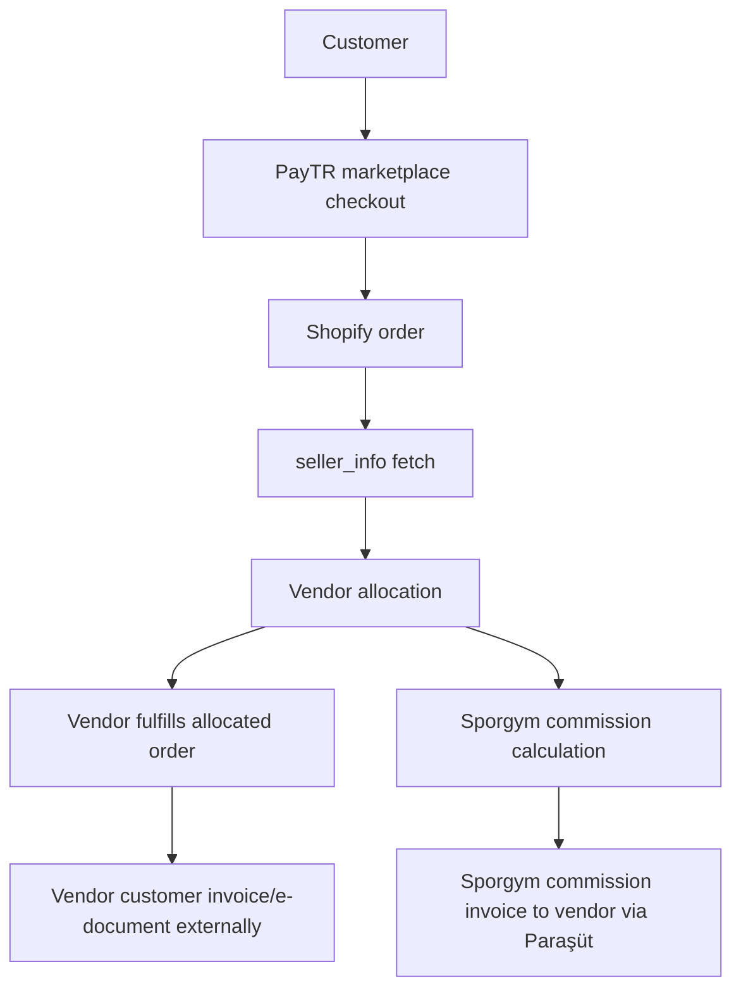
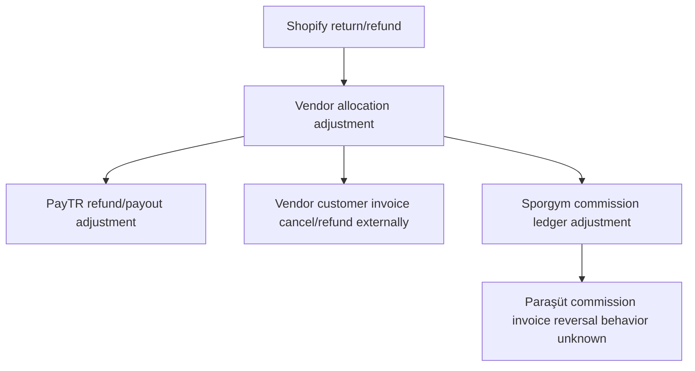
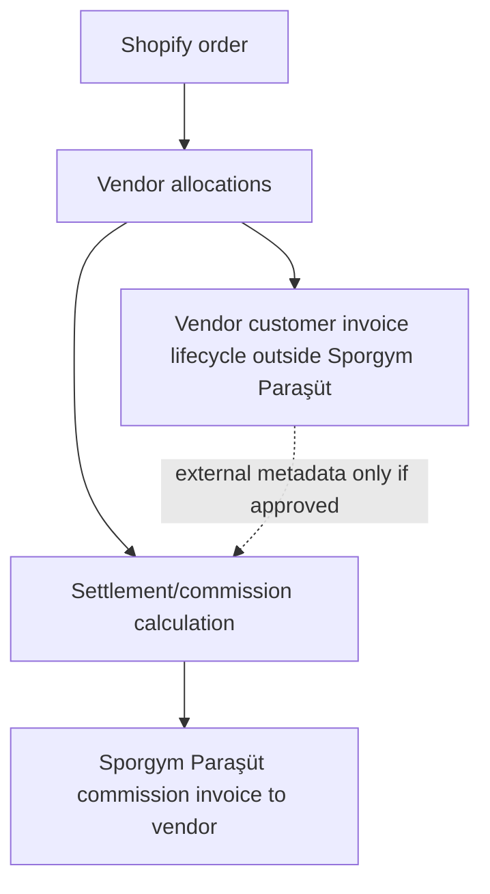

# Paraşüt Marketplace Discovery

## Purpose And Scope

This document captures discovery for possible Paraşüt accounting architecture in the current Shopify multi-vendor operational platform.

Scope:

- Discovery only.
- Paraşüt API capability mapping from available documentation.
- Accounting architecture direction for the confirmed vendor merchant-of-record model.
- Operational lifecycle mapping against existing Shopify order, vendor allocation, settlement preview, return/refund, and payout/reconciliation concepts.
- Unknowns and required external inputs before implementation.

Non-scope:

- No accounting logic implementation.
- No invoice API calls.
- No Paraşüt credential handling changes.
- No finance calculation changes.
- No database schema changes.
- No production invoice automation recommendation.
- No legal, tax, or accounting conclusion beyond the confirmed business model is treated as approved.

Important context:

- iyzico marketplace implementation is paused.
- Shopify hosted checkout plus native iyzico marketplace split is not supported.
- PayTR marketplace mode is the confirmed payment-orchestration direction.
- Current focus is Paraşüt API discovery for Sporgym commission accounting.

## Sources Reviewed

- Local Shopify source-of-truth document: `docs/SHOPIFY_DISCOVERIES.md`
- Local finance architecture documents:
  - `docs/FINANCE_LEDGER_MODEL.md`
  - `docs/FINANCE_SETTLEMENT_MODEL.md`
  - `docs/MARKETPLACE_FINANCE_WORKFLOW.md`
- Current backend schema and services:
  - `backend/prisma/schema.prisma`
  - `backend/src/modules/shopify/order-ingestion.service.ts`
  - `backend/src/modules/finance/sale-ledger.service.ts`
- Paraşüt API V4 documentation reviewed manually.
- No accounting/legal behavior is inferred from the API surface. If a behavior is not explicitly confirmed by the reviewed API documentation, it is marked `unknown`.

## Most Important Discovery

Paraşüt appears to provide:

- accounting primitives;
- invoice lifecycle;
- payment lifecycle;
- supplier/customer ledger structures.

Paraşüt does not appear to provide, from the reviewed API documentation:

- native marketplace split accounting;
- submerchant settlement logic;
- vendor payout orchestration;
- marketplace commission automation.

Therefore, Sporgym would likely need to implement:

- settlement ledger;
- vendor allocation accounting orchestration;
- reconciliation layer;
- payout tracking layer.

Paraşüt should be treated as Sporgym accounting infrastructure for commission invoicing, not as a native marketplace settlement engine or vendor customer-invoice system.

## Confirmed Business Model

- Merchant-of-record: vendor.
- Seller-of-record: vendor.
- Customer invoice owner: vendor.
- Customer e-document owner: vendor.
- Vendor sells the product to the customer.
- Vendor issues the customer invoice/e-Fatura/e-Arşiv.
- Vendor handles the customer invoice lifecycle through its own accounting or integration provider.
- Sporgym is the marketplace/platform operator.
- Sporgym collects marketplace payment through PayTR marketplace mode.
- Sporgym earns commission.
- Sporgym invoice responsibility: commission invoice to vendor.
- Paraşüt integration scope: Sporgym commission accounting only.

Paraşüt should not create customer sales invoices for Shopify orders in this model. Vendor customer invoice records may be referenced only as external metadata if later approved and modeled.

## Current Marketplace Operational Model

### Shopify Order

- Shopify is the canonical commerce/order source.
- This platform starts after Shopify order creation.
- `orders/create` webhook payload is treated as an event envelope, not final truth.
- Order metafield `custom.seller_info` is fetched separately through Shopify Admin API.
- `seller_info` maps SKU to internal vendor slug.
- Missing SKU or missing seller mapping remains unresolved and must not be guessed.

### Vendor Allocation

- `ShopifyOrderLineItem` stores Shopify line item, SKU, variant id when present, quantity, amount, and original vendor id.
- `VendorAllocation` is allocation-scoped and carries `originalVendorId`, `assignedVendorId`, fulfillment/shipping state, and reassignment state.
- `VendorAllocationLineItem` links allocation slices to Shopify line items.
- Multi-vendor orders are represented by multiple allocations, not one blended vendor record.

### Settlement Preview

- Finance values are operational estimates/review artifacts unless explicitly approved and paid by a future workflow.
- `VendorFinancialProfile` stores commission and shipping deduction configuration.
- `FinanceLedgerEntry` stores vendor-scoped sale/refund rows with profile snapshots and settlement state.
- `PayoutBatch` and `PayoutBatchLine` are draft/review artifacts, not payment execution.

### Return/Refund

- Customer return request is not the same event as refund creation.
- `refunds/create` creates vendor-scoped refund records and refund finance rows.
- Return lifecycle records and refund rows must stay allocation-scoped.
- Invoice cancellation/refund-note behavior is not modeled in the platform today.

### Payout/Reconciliation

- The current platform provides payout preparation and reconciliation visibility.
- It does not execute payouts, bank transfers, accounting exports, or tax documents.
- It must preserve auditability, vendor isolation, and allocation-level scoping.

## Confirmed Invoice Ownership Model

| Area | Confirmed Direction |
| --- | --- |
| Customer invoice owner | Vendor. |
| Customer e-document owner | Vendor. |
| Customer invoice lifecycle | Vendor handles through its own accounting or integration provider. |
| Sporgym invoice responsibility | Sporgym issues commission invoice to vendor. |
| Payment orchestration | PayTR marketplace mode. |
| Paraşüt scope | Sporgym commission accounting only. |
| Paraşüt customer invoice scope | Out of scope; Sporgym Paraşüt must not create customer sales invoices for vendor products. |
| Vendor Paraşüt onboarding | Not required for customer invoices in the confirmed model because vendor customer invoices are handled by each vendor's own accounting/integration provider. |

Unresolved within this confirmed model:

- Exact refund/cancel document process.
- Commission reversal on partial/full refund.
- PayTR payout lifecycle details.
- Vendor integration provider invoice/cancel API behavior.
- Paraşüt test/prod credential rollout details.
- Legal/accounting confirmation of the final operational process.

## Paraşüt API Capability Checklist

Status meanings:

- `supported`: Present in the provided Paraşüt API V4 facts.
- `supported, async`: Present in the provided facts and explicitly asynchronous.
- `partially supported`: Some required API surface is present in the provided facts, but lifecycle semantics are incomplete.
- `unknown`: Not present in the provided facts.

| Capability | Status | Evidence / Notes |
| --- | --- | --- |
| Customer/contact creation | supported | Customer/supplier is modeled as `contact`; contact creation/listing exists. |
| Sales invoice creation | supported | Sales invoice creation exists and requires a Paraşüt contact id; sales invoice line items require product id. |
| Sales invoice CRUD/lifecycle | supported | Sales invoice CRUD, listing/filtering, show, edit, delete, cancel, recover, archive, unarchive, convert estimate to invoice, PDF generation, payments, payment transaction retrieval, and payment transaction deletion are confirmed. Legal/accounting meaning of cancel, recover, and archive is unknown for commission-invoice compliance. |
| Purchase bill CRUD/lifecycle | supported | Purchase bill CRUD, detailed/basic purchase bills, payments, and cancel/recover/archive lifecycle are confirmed. Purchase bills are not in current Paraşüt scope because Sporgym commission invoicing is the selected direction. |
| e-invoice support | supported, async | e-Fatura formalization exists; e-document creation is asynchronous. |
| e-archive support | supported, async | e-Arşiv formalization exists; e-document creation is asynchronous. |
| e-SMM support | supported, async | e-SMM formalization exists; marketplace use is unknown. |
| Draft invoice support | unknown | Draft invoice API behavior is not present in the provided facts. |
| Invoice status retrieval | partially supported | Invoice show plus `include=active_e_document` is used after successful e-document creation; exact status lifecycle is unknown. |
| Webhook support | unknown | Webhook support is not present in the provided facts. |
| Payment status/payment recording | supported | Payments, transactions, contact debit transactions, contact credit transactions, invoice payment includes, payment status filtering, invoice payments via `include=payments`, payment transactions via `include=payments.transaction`, and payment transaction deletion are confirmed. |
| Expense/payout recording | unknown | Expense/payout APIs are not present in the provided facts. |
| Tags/custom fields | partially confirmed | Sales invoice include options explicitly contain `tags`. Tag existence is confirmed; tag CRUD behavior and arbitrary metadata capacity are unknown. |
| Line item support | supported | Sales invoice line items require product id; invoice details use product relationships. |
| Partial refund/cancel support | unknown | Partial refund/cancel support is not present in the provided facts. |
| Product creation/listing | supported | Product creation/listing exists. |
| Dispatch note/irsaliye | supported | Dispatch note / irsaliye creation exists and requires contact id and product ids. |

Additional API observations:

- API V4 base is `https://api.parasut.com/v4/{firma_no}`.
- Auth is OAuth2.
- `access_token` expires in 2 hours.
- `refresh_token` returns a new `access_token` and a new `refresh_token`.
- Rate limit is 10 requests per 10 seconds.
- `Content-Type` is `application/json` or `application/vnd.api+json`.
- API mostly follows JSONAPI.
- Sales invoice supports `order_no` and `order_date` fields.
- e-Fatura/e-Arşiv/e-SMM formalization exists.
- e-Fatura user check uses e-Fatura inbox lookup by VKN.
- e-document creation is asynchronous with statuses:
  - `pending`
  - `running`
  - `error`
  - `done`
- Async operation id is valid for 15 minutes.
- After successful e-document creation, invoice should be fetched with `include=active_e_document`.
- e-Arşiv/e-Fatura PDFs may return `204` until ready.
- PDF URL is valid for 1 hour and should be downloaded, not directly shared.
- Invoice filtering/statuses are confirmed for:
  - `payment_status`;
  - `printed` / `not_printed`;
  - `e_invoice_sent`;
  - `e_archive_sent`;
  - `overdue` / `not_due` / `paid`.
- Sales invoice relationships are relationship-heavy JSONAPI structures and can include:
  - invoice relationships;
  - `details.product`;
  - warehouse;
  - `payments.transaction`;
  - `active_e_document`;
  - contact relationships.

## Paraşüt Integration Constraints Confirmed So Far

- Paraşüt API is strongly company-scoped through `https://api.parasut.com/v4/{firma_no}/...`.
- One Paraşüt company context exists per `firma_no`.
- The confirmed scope is a Sporgym Paraşüt company context for Sporgym-issued commission invoices.
- Vendor-specific Paraşüt onboarding is not part of the customer-invoice model.
- Vendor customer invoices are handled through each vendor's own accounting or integration provider.
- A single Sporgym Paraşüt account does not imply native multi-vendor customer-invoice support.
- Marketplace payment orchestration belongs to PayTR marketplace mode, not Paraşüt.
- Because commission invoice creation requires Paraşüt contact and product/service ids, mapping tables are required before any commission invoice automation.
- E-document finalization must be treated as an async workflow with polling.
- Rate limiting must be respected: max 10 requests per 10 seconds.
- Token refresh must persist the latest `refresh_token`.
- Bulk commission invoice generation and reconciliation require throttling/queueing.

## OAuth And Account Model

Confirmed:

- OAuth2 is used.
- `access_token` expires in 2 hours.
- Refresh-token rotation exists.
- Refreshing returns a new `access_token` and a new `refresh_token`.
- The newest `refresh_token` must be persisted.
- `CLIENT_ID` and `CLIENT_SECRET` are obtained from Paraşüt support.
- Firma isolation still applies after OAuth.

Operational implications:

- Token storage/security becomes a production secret-management concern for Sporgym Paraşüt credentials.
- Token refresh failures would become operational blockers for invoice/accounting sync.
- OAuth credentials must not be logged or exposed through diagnostics.

## Implementation Warning

Implementation should NOT begin before:

- accountant review;
- legal review;
- refund/cancellation accounting decision;
- commission invoice operational-process confirmation;
- Paraşüt test probe completion.

This warning applies to commission invoice creation, e-Fatura/e-Arşiv/e-SMM formalization, payment recording, commission reversal/cancellation handling, payout/reconciliation writes, and any production-facing Paraşüt credential flow.

Do not implement:

- customer sales invoice creation in Paraşüt;
- vendor-owned Paraşüt onboarding;
- automatic e-Fatura/e-Arşiv for customer invoices;
- refund/cancel accounting automation;
- commission invoice automation before test probe and accounting confirmation.

## Required Future Mapping Model

Marketplace integration requires persistent mapping tables before any commission invoice automation because Paraşüt invoice creation depends on Paraşüt contact and product/service ids.

Required future mappings:

- `vendor_id` -> `parasut_contact_id`
- marketplace commission service/product -> `parasut_product_id`
- `settlement_batch_id` -> commission invoice reference
- `payout_id` -> payment/transaction ids if payment status recording is approved
- allocation references -> commission invoice metadata if supported

Additional candidate references:

- `vendor_id`
- `allocation_id`
- settlement batch ids
- payout ids
- reconciliation references
- external vendor customer invoice references

Tags may help label or include these references if supported. Tag existence is confirmed in sales invoice includes; tag CRUD behavior and arbitrary metadata capacity are unknown.

Customer mappings such as `shopify_customer_id` -> `parasut_contact_id` and `shopify_variant_id` / `sku` -> `parasut_product_id` are not required for Sporgym customer invoice creation because Sporgym must not create customer sales invoices for vendor products in the confirmed model.

## Confirmed Paraşüt API Primitives

### Sales Invoice Lifecycle

Confirmed sales invoice capabilities:

- sales invoice CRUD;
- invoice listing/filtering;
- invoice show;
- invoice edit;
- invoice delete;
- cancel;
- recover;
- archive;
- unarchive;
- convert estimate to invoice;
- invoice PDF generation;
- payments;
- payment transaction retrieval;
- payment transaction deletion.

Important unknown:

- Legal/accounting meaning of `cancel`, `recover`, and `archive` is unknown for commission-invoice compliance.

### Purchase Bill Lifecycle

Confirmed purchase bill capabilities:

- purchase bill CRUD;
- detailed/basic purchase bills;
- payments;
- cancel/recover/archive lifecycle.

Scope note:

- Purchase bills are not in the current Paraşüt integration scope because Sporgym-issued commission sales invoices to vendors are the selected direction.

### Payment And Reconciliation Primitives

Confirmed primitives:

- payments;
- transactions;
- contact debit transactions;
- contact credit transactions;
- invoice payment includes;
- payment status filtering.

Implication:

- Paraşüt supports accounting primitives, but this does not confirm native marketplace settlement orchestration.

### Invoice Filtering And Reconciliation Uses

Confirmed invoice filters/statuses:

- `payment_status`;
- `printed` / `not_printed`;
- `e_invoice_sent`;
- `e_archive_sent`;
- `overdue` / `not_due` / `paid`.

Potential future use:

- finance reconciliation dashboards;
- invoice readiness review;
- payment status review;
- e-document follow-up queues.

Unknown:

- Exact invoice lifecycle semantics for commission-invoice compliance.
- Whether these filters are sufficient for allocation-scoped reconciliation.

### Contact Model

Confirmed:

- Contacts are used for customers.
- Contacts are used for suppliers/vendors.

Potential implication:

- Vendors may be modeled as contacts inside a Sporgym-owned Paraşüt account.

Unknown:

- Whether modeling vendors as contacts inside Sporgym account is legally/accountingly correct.

### Async E-Document Lifecycle

Confirmed lifecycle:

```text
sales invoice
  -> e-Fatura/e-Arşiv/e-SMM request
  -> async job id
  -> polling
  -> pending/running/error/done
  -> active_e_document retrieval
  -> PDF polling
  -> temporary PDF URL
```

Production implementation would require:

- async job tracking;
- retries;
- polling;
- queue management;
- timeout handling.

No implementation is approved by this document.

### Webhook Visibility

No visible webhook documentation is confirmed from the reviewed Paraşüt API V4 documentation.

Implication:

- Webhook support remains `unknown`.
- Polling may be required unless webhook docs are later confirmed.

## Architecture Direction

Recommended direction:

```text
PayTR marketplace payment
  + vendor-issued customer invoice
  + Sporgym-issued vendor commission invoice via Paraşüt
```

Implications:

- Vendor is merchant-of-record and owns customer invoice/e-document lifecycle.
- PayTR marketplace mode handles payment orchestration/split direction.
- Sporgym calculates commission from allocation/settlement records.
- Sporgym uses Paraşüt only for Sporgym -> vendor commission invoices.
- Paraşüt may record payment/collection status for commission invoices if approved.
- Paraşüt may tag commission invoices with `vendor_id`, `settlement_batch_id`, `payout_id`, and allocation references if supported.
- Vendor customer invoice records may be referenced only as external metadata, not created by Sporgym Paraşüt.

Why this avoids vendor-owned Paraşüt onboarding:

- Vendors do not need to connect Paraşüt to Sporgym for customer invoice creation.
- Each vendor handles customer invoices through its own accounting or integration provider.
- Sporgym only needs its own Paraşüt account for commission accounting.

Remaining architecture unknowns:

- Exact PayTR payout lifecycle details.
- Exact commission reversal on partial/full refund.
- Exact Paraşüt cancel/recover/archive behavior for commission invoices.
- Vendor integration provider invoice/cancel API behavior.
- Paraşüt test/prod credential rollout details.
- Final accountant/legal confirmation of the operational process.

## Operational Lifecycle Mapping

### A. Normal Sale

```text
Shopify order
  -> orders/create webhook envelope
  -> canonical seller_info fetch
  -> vendor allocation
  -> PayTR marketplace payment/split
  -> vendor receives allocated order
  -> vendor issues customer invoice externally
  -> sale finance ledger row
  -> settlement preview
  -> Sporgym calculates commission
  -> Sporgym creates commission invoice to vendor in Paraşüt
```

Discovery notes:

- Vendor is the customer invoice owner.
- Sporgym Paraşüt must not create customer sales invoices for vendor products.
- Paraşüt contact/customer for Sporgym scope should represent the vendor as commission-invoice recipient, not the Shopify customer.
- Paraşüt product/service item should represent marketplace commission if needed.
- Vendor customer invoice references may be stored only as external metadata if later modeled.

Unknown:

- Whether PayTR payment state is sufficient for commission invoice payment recording.
- Exact commission invoice timing relative to payout/settlement batch.
- Exact vendor external invoice reference format.

### B. Multi-Vendor Order

```text
Shopify order
  -> multiple SKU/vendor mappings
  -> multiple VendorAllocation records
  -> PayTR marketplace split direction per vendor
  -> each vendor handles customer invoice externally
  -> vendor-scoped settlement records
  -> Sporgym commission invoices to vendors through Paraşüt if approved
```

Discovery notes:

- Current platform correctly scopes operations by allocation.
- Paraşüt invoice ownership in Sporgym scope applies only to Sporgym commission invoices.
- Multi-vendor customer invoice responsibility remains with vendors and their external providers.
- One Sporgym `firma_no` is enough only for Sporgym commission accounting unless future requirements prove otherwise.

Unknown:

- Whether invoice line metadata can safely preserve vendor allocation references.
- Whether one commission invoice per vendor, per settlement batch, or per payout is required.
- Whether external vendor invoice references must be attached to allocation records.

### C. Return/Refund

```text
Shopify return/refund
  -> vendor allocation adjustment
  -> PayTR refund/payout adjustment
  -> refund record / finance ledger row
  -> settlement adjustment
  -> vendor handles customer invoice cancellation/refund document externally
  -> Sporgym adjusts commission ledger
  -> Paraşüt commission invoice cancellation/credit/reversal behavior unknown until tested/accountant-approved
```

Discovery notes:

- Current platform records Shopify refund rows and settlement impact, but does not create accounting documents.
- Vendor owns customer invoice cancellation/refund documents.
- Sporgym owns only commission accounting impact.
- Legal/accounting meaning of Paraşüt sales invoice cancel/recover/archive is unknown for commission-invoice compliance.

Unknown:

- Exact refund/cancel document process used by vendor integration providers.
- Commission reversal behavior on partial/full refund.
- Whether commission invoice cancellation, credit, or reversal should be used in Paraşüt.

### D. Vendor Payout

```text
settlement preview
  -> PayTR payout lifecycle
  -> payout/reconciliation review
  -> draft payout batch artifact
  -> Sporgym commission invoice/payment status review in Paraşüt if approved
```

Discovery notes:

- PayTR marketplace mode owns payment orchestration direction.
- Sales invoice payment collection/retrieval is supported by the provided Paraşüt facts and may be relevant for commission invoices.
- Expense/payout recording is unknown from the provided Paraşüt facts and is not part of the immediate scope.
- Current payout batches are not payment execution.

Unknown:

- PayTR payout lifecycle details.
- Whether commission invoice payment status should be marked from PayTR payout/settlement evidence.
- Whether commission is invoiced per order, settlement batch, payout batch, or accounting period.

### E. Dispatch Note / İrsaliye

```text
Shopify fulfillment / shipment context
  -> vendor allocation shipment ownership
  -> vendor shipment/customer invoice lifecycle externally
```

Discovery notes:

- Dispatch note / irsaliye creation exists.
- Contact and product relationships are required.
- Paraşüt irsaliye is not in current Sporgym commission-accounting scope.

Unknown:

- Whether Paraşüt irsaliye fits marketplace shipment ownership requirements.
- Whether vendors' external accounting/integration providers handle irsaliye.
- Whether carrier/provider shipping records need any external dispatch-note linkage.

## Accounting Flow Diagrams

### Confirmed Vendor Merchant-Of-Record Flow



### Return / Refund Commission Flow



### Paraşüt Scope Boundary



## Recommended Direction

Recommended technical direction:

PayTR marketplace payment plus vendor-issued customer invoice plus Sporgym-issued vendor commission invoice via Paraşüt.

Implementation should not begin before:

- accountant review of the final operational process;
- legal review of the final operational process;
- refund/cancellation accounting decision;
- commission reversal decision;
- Paraşüt test probe completion.

Do not reopen merchant-of-record as unknown: vendor is merchant-of-record in the confirmed model.

1. Phase 0: document only
   - Record vendor merchant-of-record model.
   - Request Paraşüt API credentials/test company for Sporgym.
   - Confirm PayTR marketplace lifecycle details.
   - Do not add API calls, invoice creation, e-document formalization, schema, or finance calculation changes.

2. Phase 1: commission invoice mapping design only
   - No customer invoice creation.
   - Model required mappings:
     - `vendor_id` -> `parasut_contact_id`
     - marketplace commission service/product -> `parasut_product_id`
     - `settlement_batch_id` -> commission invoice reference
     - `payout_id` -> payment/transaction ids if approved
     - allocation references -> commission invoice metadata if supported
   - Include OAuth token ownership and refresh-token persistence design.
   - Include rate-limit-aware read-only probe design.

3. Phase 2: controlled Paraşüt test probe only
   - Probe OAuth/token lifecycle.
   - Probe `/me`.
   - Probe vendor contact lookup/create.
   - Probe product/service item for marketplace commission lookup/create if needed.
   - Create commission sales invoice in test account only.
   - Probe commission invoice payment status.
   - Probe tags/include behavior.
   - Probe cancel/recover/archive behavior.
   - No customer invoice creation.

4. Phase 3: commission invoice prototype only after accounting confirmation
   - Prototype Sporgym -> vendor commission invoice creation only.
   - Customer e-Fatura/e-Arşiv remains vendor-owned and out of Paraşüt scope.
   - Treat any commission e-document finalization as async with job tracking, polling, retries, queue management, timeout handling, active e-document retrieval, and PDF polling if later approved.

5. Phase 4: production feature flags and audit logs
   - Feature flags must default off.
   - Production rollout must start with narrow scope.
   - Audit logs must capture safe ids/statuses without raw payloads or secrets.
   - Token refresh, polling, retry, and rate-limit behavior must be explicit before production writes.
   - Bulk commission invoice generation and reconciliation must be throttled/queued for the 10 requests per 10 seconds limit.

Do not recommend production commission invoice automation yet.

Near-term preference:

- Run the controlled Paraşüt test probe only, with no customer invoice creation.

## Next Technical Phase

Controlled Paraşüt test probe only:

- OAuth/token lifecycle.
- `/me`.
- Vendor contact lookup/create.
- Product/service item for marketplace commission lookup/create, if needed.
- Commission sales invoice create in test account only.
- Commission invoice payment status probe.
- Tags/include behavior probe.
- Cancel/recover/archive behavior probe.
- No customer invoice creation.

## Explicit Unknowns

- Exact refund/cancel document process.
- Commission reversal on partial/full refund.
- PayTR payout lifecycle details.
- Vendor integration provider invoice/cancel API behavior.
- Paraşüt test/prod credential rollout details.
- Legal/accounting confirmation of the final operational process.
- Whether iade/refund requires separate invoice types.
- Whether e-document cancellation rules exist.
- Whether Paraşüt has usable sandbox/test company.
- Whether draft invoices exist in API.
- Whether webhook support exists.
- Whether webhook/event APIs exist.
- Whether expense/payout APIs exist.
- Whether tag CRUD APIs exist.
- Whether tags/custom fields exist outside special requirements.
- Whether vendor external invoice references should attach to allocation/finance records.
- Whether PayTR settlement evidence is sufficient for commission invoice payment status.
- Whether commission should be invoiced per order, settlement batch, payout batch, or accounting period.
- E-Fatura/e-Arşiv implications for Sporgym commission invoices.
- Status lifecycle details beyond the provided async statuses.
- Rate limits beyond the provided 10 requests per 10 seconds.
- Whether Paraşüt contact debit/credit transactions are sufficient for reconciliation dashboards.
- Whether invoice PDF URLs may be stored after download or must be re-fetched.

## Required External Inputs Before Implementation

- Paraşüt API docs link/access.
- Paraşüt sandbox or test company credentials for Sporgym.
- Accountant/legal confirmation of the final vendor-MoR operational process.
- Required commission invoice scenarios from accountant.
- Commission reversal/cancellation accounting requirements.
- PayTR marketplace payout/refund lifecycle details.
- Vendor integration provider invoice/cancel lifecycle details if external references are modeled.
- E-Fatura/e-Arşiv usage requirements for Sporgym commission invoices.
- Paraşüt OAuth/client setup details.
- Paraşüt webhook setup instructions and signing secret/encryption key model.
- Paraşüt e-document activation status for the intended company/account.
- Confirmation of whether test commission e-Fatura/e-Arşiv documents can be created without legal production effect.
- Confirmation of required vendor/contact/product/settlement/payout mapping ownership.

## Implementation Stop Conditions

- Paraşüt credentials are unavailable or production-only.
- E-Fatura/e-Arşiv activation requirements for Sporgym commission invoices are unknown.
- Refund/cancel commission reversal requirements are unknown.
- PayTR payout/refund lifecycle details are unknown.
- Vendor/contact/product/settlement/payout mapping ownership is unresolved.
- OAuth token storage and refresh-token rotation design is unresolved.
- Queueing/throttling design for the 10 requests per 10 seconds limit is unresolved.
- Any proposed implementation would create official accounting documents before sandbox/test confirmation.
- Any proposed implementation would create customer sales invoices in Sporgym Paraşüt.
